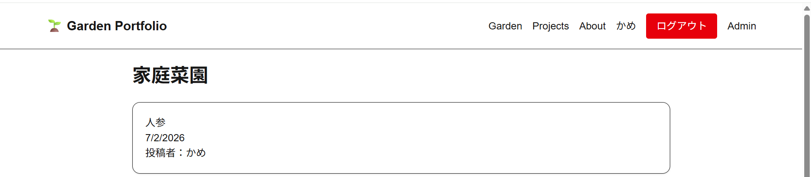
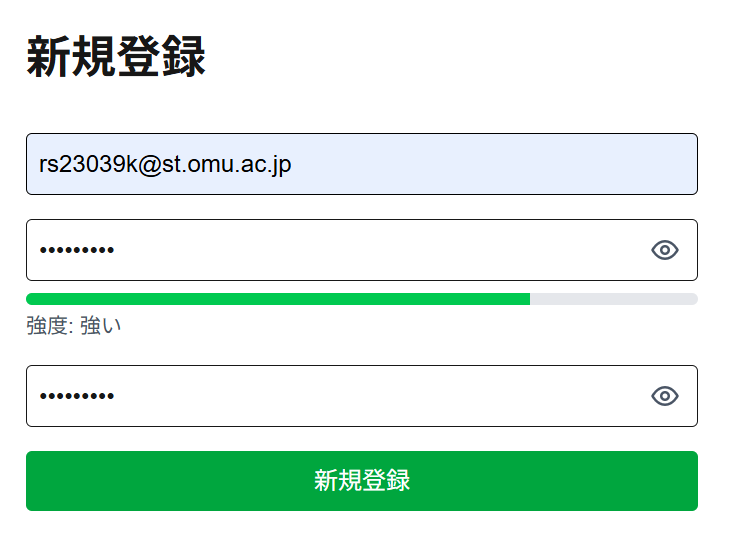
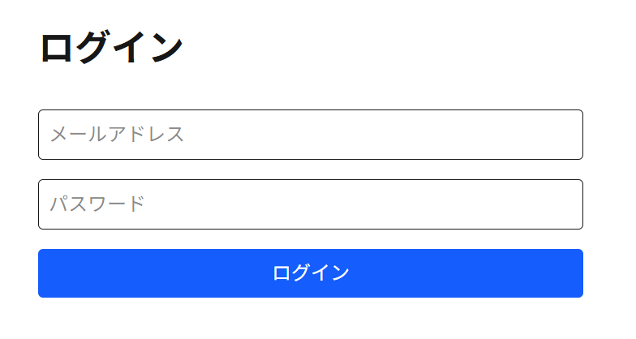
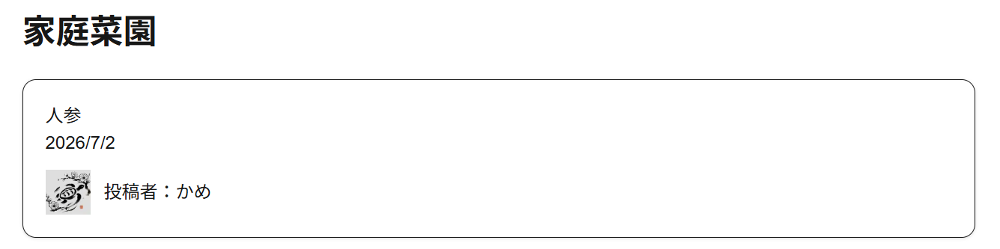
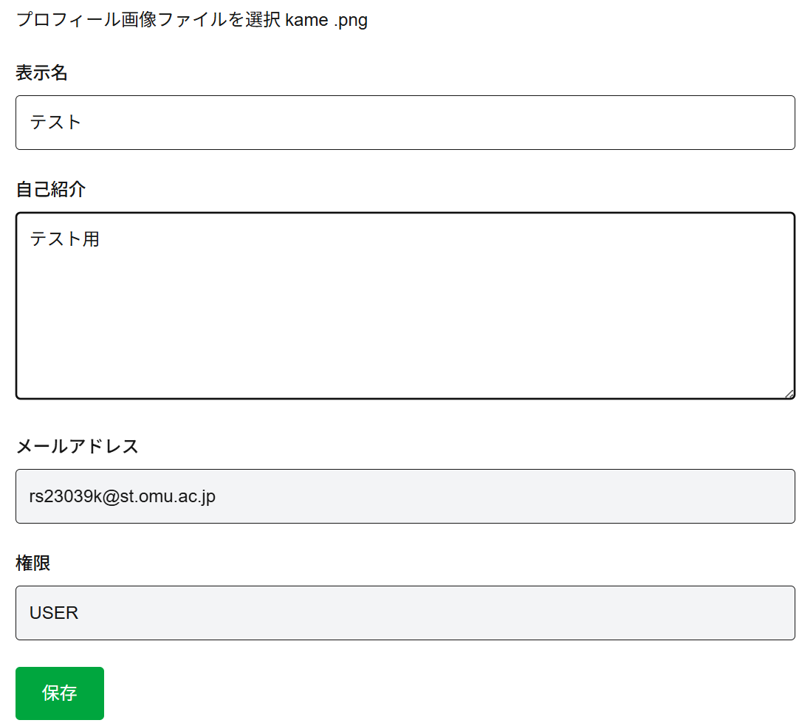
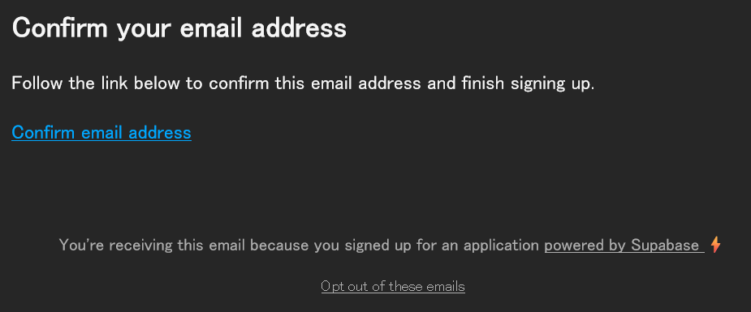

# Garden Portfolio

## 概要

Garden Portfolio は家庭菜園の記録を管理するWebアプリです。

本課題ではセッションベース認証・認可機能を中心に、安全なユーザー管理を実現することを目的として実装しました。

## リンク

- https://garden-app-olive.vercel.app/

## 開発時間

約17時間

---

# 1. この課題で実装したこと

## 採用した認証方式

- セッションベース認証
- Supabase Auth を利用したメールアドレス + パスワード認証
- Next.js App Router と `@supabase/ssr` によるサーバーサイドセッション管理

## 実装した認証・認可機能

- ログイン状態に応じたヘッダー表示の切り替え
  - 未ログイン時: Login / Sign Up
  - ログイン時: プロフィール名・Logout・Admin リンク
- ロールベース認可
  - ADMIN のみ家庭菜園ログを新規作成可能
- ログイン必須制御
- メールアドレス・パスワード認証
- サインアップ時のメール認証（Email Verification）
- 認証完了後のみログイン可能
- サーバーサイドでのセッション管理（@supabase/ssr）
- Server Action 側での権限チェック
- Supabase Auth と Prisma の UserProfile 自動同期

## プロフィール機能

- 表示名の編集
- 自己紹介の編集
- プロフィール画像のアップロード
- 保存後も画像が保持されるように対応

## 入力補助

- 新規登録画面でのパスワード確認入力欄
- パスワード強度メーター
- パスワードの表示 / 非表示切り替え
- ログイン画面でのパスワード表示 / 非表示切り替え

---

# 2. アプリ概要

Garden Portfolio は、家庭菜園の記録を投稿・閲覧できる Web アプリです。

## 主な機能

- 投稿一覧表示
- 投稿詳細表示
- 画像を Supabase Storage に保存
- 投稿者情報の表示
- 管理者のみ新規投稿可能
- プロフィール編集
- 新規登録 / ログイン

---

# 3. 画面一覧

- ホーム

- 新規登録

- ログイン

- 家庭菜園一覧

- 家庭菜園詳細
- 管理画面
- 新規投稿
- プロフィール編集

---

# 4. セキュリティ設計

## 認証

- Supabase Auth を採用
- パスワードはアプリ側で保持しない
- セッション管理は `@supabase/ssr`
- メールアドレス・パスワードによるサインアップ
- サインアップ時に確認メールを送信
- メール内の認証リンクをクリックすることでアカウントを有効化
- メール認証後のみログイン可能

## 認可

- ADMIN のみ投稿作成可能
- ログインユーザーのみプロフィール編集可能
- Server Action 側でも `requireAdmin()` により権限を再確認

## セッション管理

用途ごとに Supabase クライアントを分離しています。

| 場所             | 役割                                 |
| ---------------- | ------------------------------------ |
| Server Component | 読み取り専用セッション               |
| Route Handler    | ログイン・ログアウト・セッション更新 |
| Server Action    | 更新処理・権限チェック               |

## 画像アップロード

- Supabase Storage に保存
- Public URL を利用して表示
- Next.js 側で画像ホストを限定

## データベース設計

Prisma を利用してデータを管理しています。

### UserProfile

- Supabase Auth と連携
- 表示名
- 自己紹介
- ロール管理
- アバター画像パス管理

### GardenLog

- タイトル
- 本文
- 画像
- 投稿者(UserProfile)とリレーション

投稿者情報はサーバー側で取得し、クライアントから送信された情報は信用しない設計にしています。

---

# 5. 工夫した点

- 認証状態に応じてヘッダー表示を変更
- 投稿作成を ADMIN のみに限定し権限境界を明確化
- プロフィール編集を独立させ保守性を向上
- 認証 Callback で Supabase の Session と Prisma の UserProfile を同期
- 外部画像は Supabase Storage のみ許可
- Server Action・Route Handler・Server Component を役割ごとに分離
- パスワード入力に強度メーターと表示切り替えを追加し、入力体験を改善
- メール認証を必須とし、メールアドレスの所有者のみがアカウントを有効化できるようにした。
- 認証完了後にセッションを発行する構成とし、不正登録を防止している。

---

# 6. 使用技術

| カテゴリ       | 技術             |
| -------------- | ---------------- |
| Framework      | Next.js 15       |
| Language       | TypeScript       |
| UI             | React 19         |
| CSS            | Tailwind CSS     |
| Database       | Prisma           |
| Authentication | Supabase Auth    |
| Storage        | Supabase Storage |
| SSR            | `@supabase/ssr`  |
| Lint           | ESLint           |

---

# 7. 今後の改善候補

- 監査ログ機能
- CSP・セキュリティヘッダー強化
- Storage の画像削除連携
- 投稿編集・削除機能
- エラーメッセージの UI 改善
- アクセシビリティ向上
- 入力フォームの共通コンポーネント化

